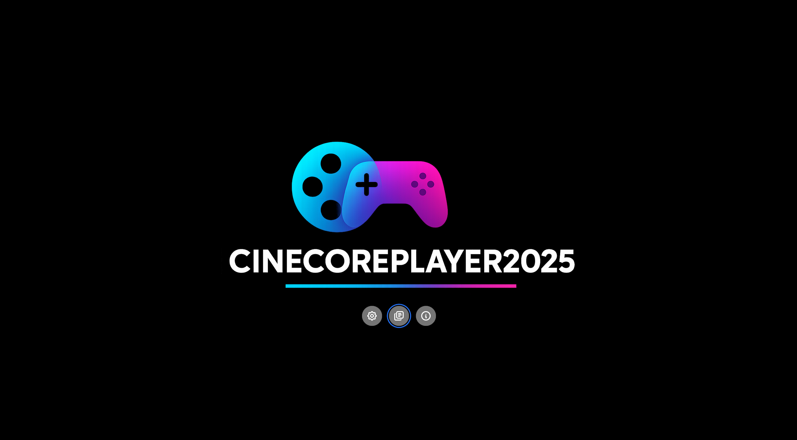
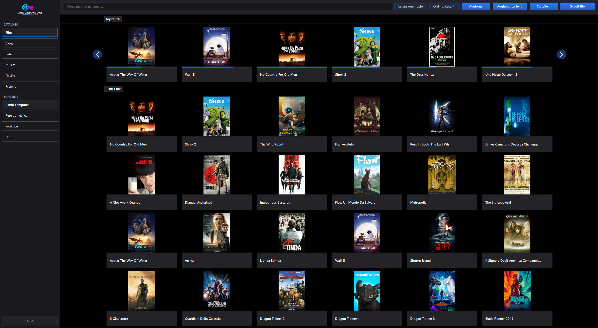
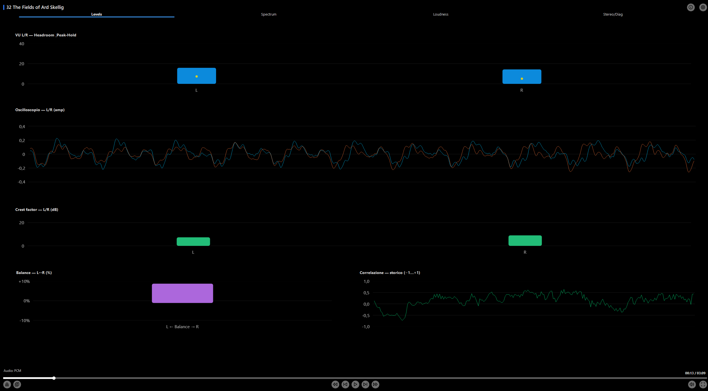
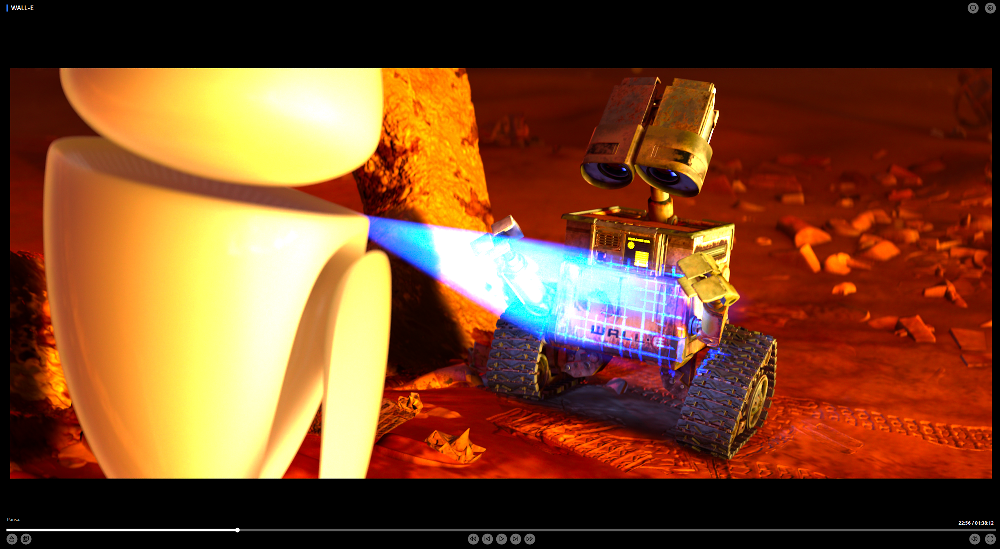

# 🎬 Cinecore Player 2025

A **free**, **non‑commercial** media player for **Windows**, built in **C# / .NET 9.0** and powered by a **unified DirectShow engine**.  
It features intelligent **HDR management** and supports multiple high‑end **video renderer backends**, including **madVR**, **MPC Video Renderer (MPCVR)**, and **EVR**.

Designed also for **audiophiles**, the player includes a dedicated **Audio Mode** with real‑time visualizations such as **oscilloscope** and **spectrum analyzer**.  
Audio output supports both **bitstream** and **PCM**, with full compatibility for **exclusive** and **non‑exclusive** modes.

---

## 📸 Screenshots

---

## ✅ Working features

- **Video playback via madVR and EVR**  
  Core playback is stable on both renderers.

- **Audio playback (PCM & Bitstream)**  
  Standard playback works reliably across formats.

- **Audio graphs**  
  Rendering is functional; overall accuracy appears correct, pending further validation.

- **Photo viewer**  
  Fully operational, with planned quality‑of‑life improvements.

- **HUD / On‑Screen Display**  
  Generally stable and responsive.

- **Online Remote Control**  
  Nearly fully integrated and works consistently during playback.

---

## ⚠️ Known issues

- **Renderer settings not yet integrated**  
  Player‑side configuration panels are incomplete; users must adjust settings directly inside each renderer (madVR / EVR).

- **HUD visual glitches**  
  Occasional minor graphical artifacts still under investigation.

- **Remote pairing persistence**  
  Device pairing is not saved reliably; the player may request re‑pairing on each startup.

- **Audio graphs in exclusive PCM mode**  
  In audio‑only playback, graphs work only in non‑exclusive PCM. Exclusive mode support is planned.

- **DLNA module**  
  Highly incomplete and prone to errors despite partial implementation.

---

## 🚧 Current limitations

- **3D‑to‑2D conversion**  
  Currently functional only with EVR; madVR support is planned.

- **Player settings coverage**  
  Several configuration sections are only partially implemented.

---

## 🛠️ In development

- **Favorites**
- **Playlists**
- **YouTube integration**
- **DLNA improvements**
- **Expanded renderer settings**
- **Additional HUD refinements**
- **General QoL enhancements across the UI**

Many other addition are being developed.
English localization is in development.
